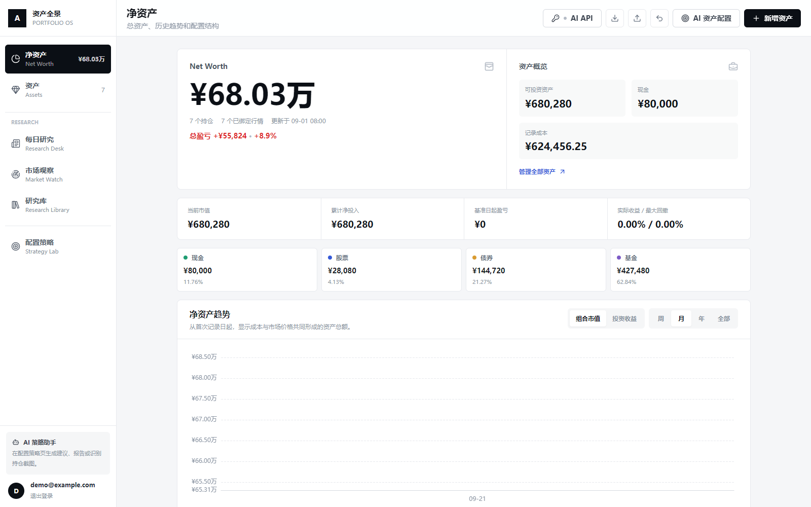

# Portfolio OS Marketplace Edition

Portfolio OS 是一个本地优先的个人资产配置与投研工作台。这个仓库是面向 DSH 插件市场的独立发行版：用户安装插件后即可使用，不需要 Docker、PostgreSQL、Python 或源代码。



## 功能

- 多币种持仓、现金账户、买卖与转仓流水
- 资产配置、核心暴露、地区分布与组合表现
- 市场观察、宏观事件、新闻、财报与社交热度
- 每日新闻、持仓复盘、研究库与量化研究记录
- AI 策略助手与自动研究简报
- 本地注册、资产备份导入与导出

市场版只管理当前用户可支配的个人组合，不包含家庭成员资产模块。

## 安装后的结构

```text
DSH Desktop
  └─ dsh-portfolio-os
       ├─ React frontend
       ├─ FastAPI backend
       ├─ SQLite database
       └─ research scheduler
```

插件只监听 `127.0.0.1`。资产、账号和研究内容默认保存在：

```text
%LOCALAPPDATA%\PortfolioOS
```

卸载插件不会删除该目录，因此升级或重装不会丢失数据。

## AI API

登录后点击页面右上角的 **AI API**，可配置 Agnes 或其他 OpenAI-compatible 服务。该配置同时供以下功能使用：

- 配置策略页的 AI 策略助手
- 研究库的每日持仓复盘
- 每日新闻与自动简报
- 导入研究资料时的 AI 整理

API Key 通过 Windows DPAPI 加密，只能由当前 Windows 用户解密。Key 不写入 SQLite、资产备份、前端存储、日志或 Git。

## 从 DSH 安装

GitHub Release 构建完成后，可在一个全新的 DSH profile 中安装固定版本：

```powershell
dsh plugin --profile portfolio-test add https://github.com/Snowball-labbot/Portfolio-OS/releases/download/v0.2.1/dsh-portfolio-os-0.2.1.tgz
```

插件包已经包含 Windows Runtime，不需要 Docker、Python 或 Node.js 开发环境。Release 同时提供 `RELEASE-SHA256SUMS.txt` 用于校验下载文件。

## 隐私边界

- 服务仅监听 `127.0.0.1`，不会向局域网或公网开放端口。
- 每位安装者在本机自行注册；发行包不预置账号、邮箱、持仓、研究报告或家庭资料。
- 资产数据、上传文档和 AI 凭据均保存在当前 Windows 用户的数据目录，不进入插件包。
- 只有用户主动使用 AI 功能时，相关请求上下文才会发送给用户配置的 API 服务。
- 发布流程会扫描 API Key、私人邮箱、本机用户名、个人报告和已移除模块残留，发现后立即中止构建。

## 本地开发

```powershell
npm ci
npm run build
python -m pip install -r backend/requirements-marketplace.txt
python -m marketplace_runtime.launcher --port 41731
```

打开 `http://127.0.0.1:41731`。市场版默认允许首个用户在本机注册。

## 构建市场包

```powershell
./scripts/pack-release.ps1
```

构建会生成两个 npm tarball：

- `@snowball-labbot/portfolio-os-win32-x64`：独立 Windows Runtime 包
- `dsh-portfolio-os`：DSH Host、侧栏入口和内置 Windows Runtime，可单包安装

打 Tag 后，GitHub Actions 会在 Windows Runner 上构建并将两个包附加到 Release。普通用户只需安装 `dsh-portfolio-os` 包。

## 与 Docker 版的边界

本仓库不会读取或迁移开发者本机 Docker Volume，也不包含任何个人资产、数据库、备份、Cookie、API Key 或 `.env`。Docker 版仍可独立运行；市场版使用自己的 SQLite 数据目录。

## License

[MIT](LICENSE)
